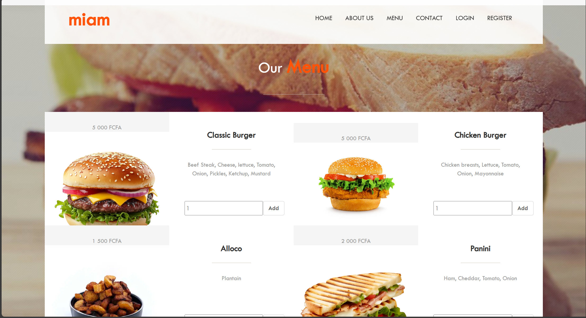
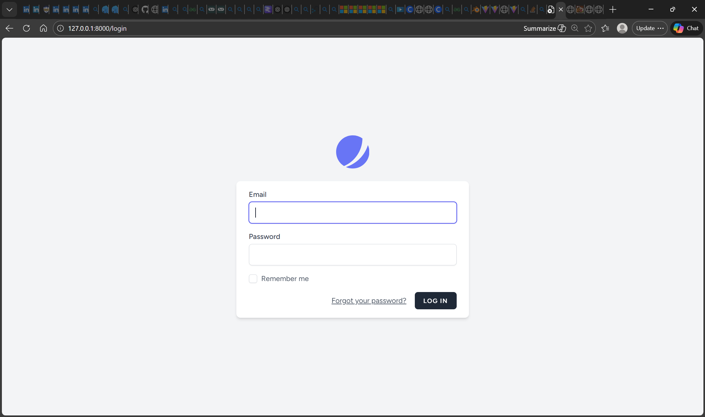
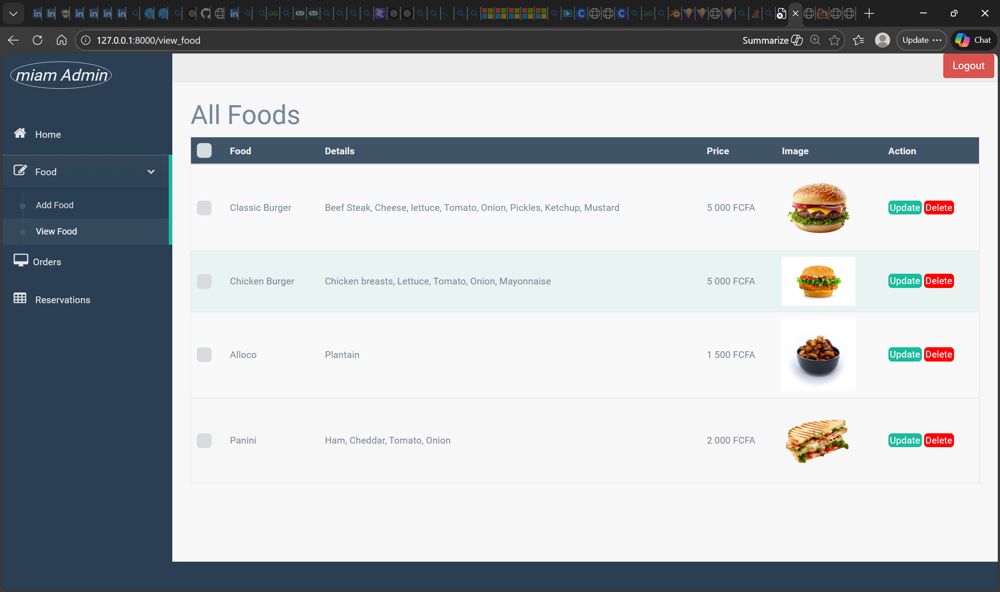

# 🍔 MIAM RESTAURENT
A modern restaurant management system built with Laravel, designed to handle menus, orders, and reservationsoperations through a clean RESTful architecture. 

## 🚀 Features
- User authentication & authorization
- Restaurant menu management
- Order creation
- Admin dashboard
- RESTful API structure
- Secure authentication with Jetstream

## 🛠️ Tech Stack
- Backend: Laravel
- Database: MySQL 
- Authentication: Laravel Jetstream
- API: RESTful API
- Frontend: Blade

## 📦 Installation
- PHP >=  8.4
- Composer
- MySQL

### Steps
```
# Clone the repository
git clone https://github.com/koffibenyamin/miam-restaurant.git

# Navigate into the project
cd your-repo-name

# Install PHP dependencies
composer install

# Copy environment file
cp .env.example .env

# Generate app key
php artisan key:generate
```

## ⚙️ Environment Configuration
```
DB_DATABASE=miam_db
DB_USERNAME=[username] 
DB_PASSWORD=[password]
```
## 🗄️ Database Setup: MySQL
- Create database 
```sql
CREATE DATABASE miam_db
```
- Import the content of the file in `miam.sql` in the database to create tables and test data
- 
## ▶️ Running the Application

```
php artisan serve
```
The app will be available at:

```
http://127.0.0.1:8000
```
## ⭐Tips
- admin account:
Email:`admin@gmail.com` password: `12345678`
- client acount:
Email:`jules@example.com` password: `12345678`

## 📸 Screenshots
- Landing Page:


- Login Page:


- Admin page:


## 📄 License

This project is open-sourced under the **MIT license**.


